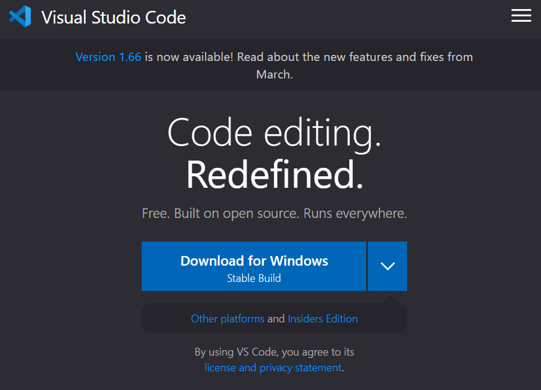
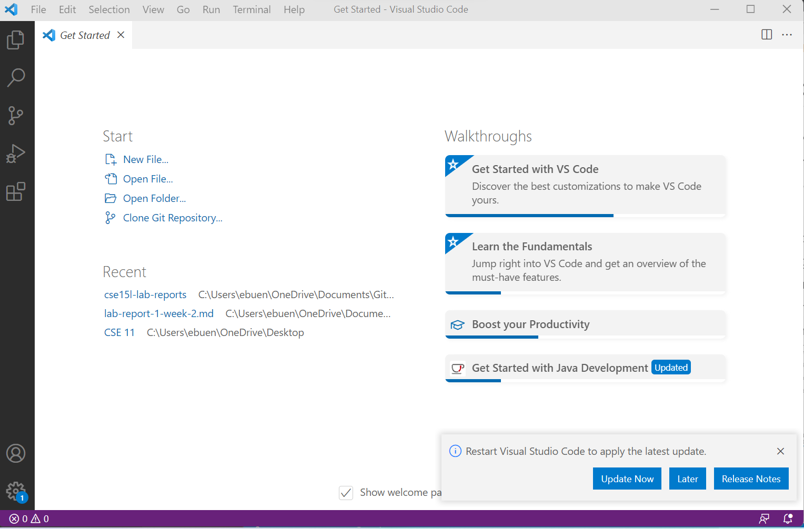
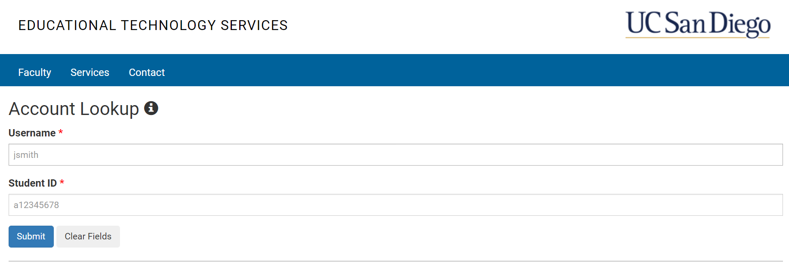
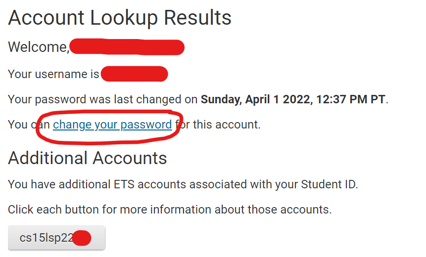
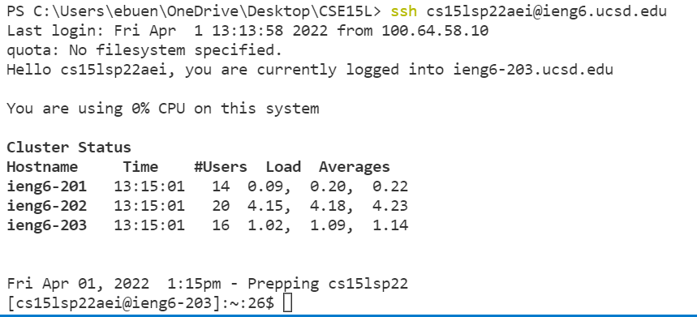
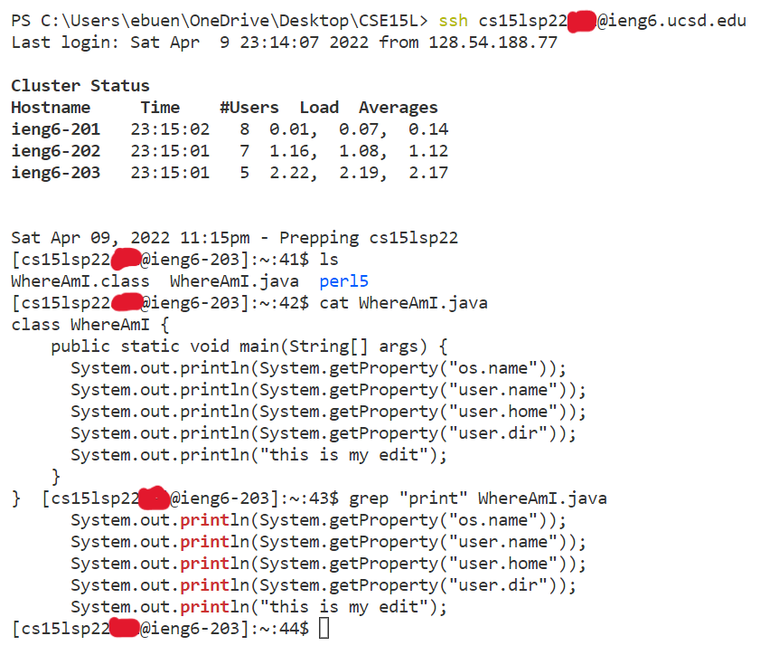
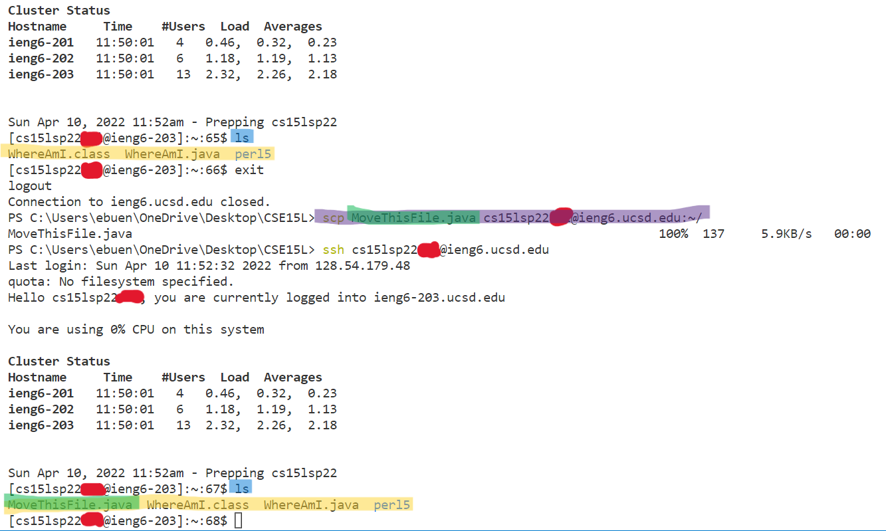
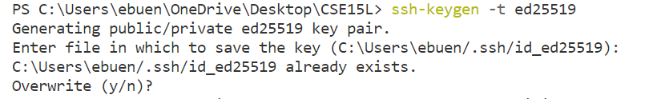
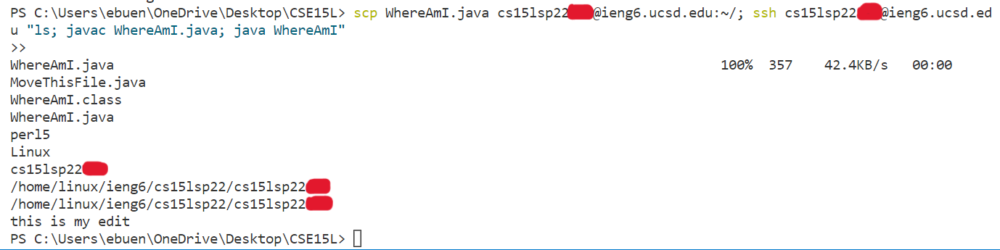

# **Lab Report 1**
>## *How to log in to log into a course-specific account on ieng6*

### **Installing VScode (*for windows*)**
Installing VScode is actually fairly easy, the only thing you need to do is go to the Visual Studio Code website and download the program directly from there.

Here is the website for your convenience: [https://code.visualstudio.com/](https://code.visualstudio.com/)

>*an example of what the VScode downloading page should look like*

Once you've downloaded VScode onto your desktop, the starting page should look something similar to this:

If you see this page (and or something similar), then you have successfully completed installing VScode and can continue to the next step!

### **Remotely Connecting**
The first step of connecting to a remote computer through your CS15L assigned account is to change its password.

To accomplish this, go to the website: [https://sdacs.ucsd.edu/~icc/index.php](https://sdacs.ucsd.edu/~icc/index.php) and sign in through *Account Lookup* with your UCSD username and PID.

>the *Account Lookup* screen

After logging in, you'll be able to see your assigned CS15L account, as well as the link that says "change your password."

>you can see your CS15L account under *Additional Accounts* and can change your password by cliking on the link circled in red

*WARNING*: when you change your CS15L account password, it'll also change your triton link password too!

Now with your new password, you'll be able to connect remotely! Firstly, open a new terminal by going to the *Terminal* tab and click *New Terminal*.

Then use the *Secure Shell* command to log in to your CS15L account by typing: `ssh <CS15L username>@ieng6.ucsd.edu` into the terminal and put in your password

*WARNING*: you won't be able to see your password being typed; it'll appear as if you're typing nothing

If you see something similar to *Cluster Status* after you log in, that's when you know you succesfully connected remotely!

>an example of what a succesful login looks like

### **Trying Some Commands**
Now that you've succesfully connected remotely to your CS15L account, try testing out different basic commands! Here's a guide to help you get started: [Basic Commands](https://www.hostinger.com/tutorials/ssh/basic-ssh-commands)

> an example of using some basic commands

### **Moving Files with *scp***
You can move files from your local computer to the server and make them accessible from different devices by using the command *Secure Copy*.

You use the command by typing `scp <file name> <CS15L username>@ieng.ucsd.edu:~/` when you're not logged into your CS15L account.

this moves `<file name>` from your local computer to the CS15L server. After you run this command, you should be able to see `<file name>` in the list of files on your CS15L account when using the `ls` command.

>before running the `scp` command, the file `MoveThisFile.java` wasn't listed when running `ls`, but after running the `scp` command, `MoveThisFile.java` is now seen when runnning `ls`.

### **Setting an SSH Key**
Using the CS15L accounts requires entering your password multiple times, which is quite the hassle, so instead, it'd be easier to create an SSH Key to replace entering a password.

In the terminal, when you're not logged into your CS15L account, run the command: `ssh-keygen -t ed25519` then keep pressing *enter* until it stops asking questions. This creates a `.shh` directory and a file `id_rsa.pub` on your local computer.

>running the command will look something similar to this, but not exactly alike since I already had a previous SSH Key.

You now need to create the `.shh` directory on your CS15L account, by running the command: `mkdir .ssh` when you're logged in. Then you copy the `.shh` directory and `id_rsa.pub` file from your computer into the server by using `scp` when you're not logged in.

The command should look something similar to: `scp /Users/<Computer username>/.ssh/id_rsa.pub <CS15L username>@ieng6.ucsd.edu:~/.ssh/authorized_keys`

 Once it's copied, you should be able to log into your CS15L account without a password. 

### **Optimizing Remote Running**
For better optimization, you can run multiple commands on one line. Use a semicolon (`;`) to seperate different commands locally, and add quotation marks (`" "`) under all of the commands and semicolons to separate them when running on the server.

>the first command (`scp`) and the log in command (`ssh`) aren't in quotation marks because they're commands that run locally, but the rest of the commands (`ls`, `javac`, `java`) run through the server so the all of them are under the same quotations marks while being separated by semicolons.
