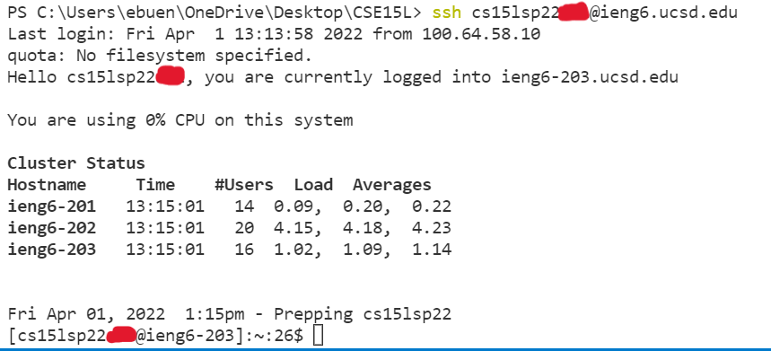

# **Lab Report 1**
>## *How to log in to log into a course-specific account on ieng6*

### **Installing VScode (*for windows*)**
Installing VScode is actually fairly easy, the only thing you need to do is go to the Visual Studio Code website and download the program directly from there.

Here is the website for your convenience: [https://code.visualstudio.com/](https://code.visualstudio.com/)

>*an example of what the VScode downloading page should look like*

Once you've downloaded VScode onto your desktop, the starting page should look something similar to this:

If you see this page (and or something similar), then you have successfully completed installing VScode and can continue to the next step!

### **Remotely Connecting**
The first step of connecting to a remote computer through your CS15L assigned account is to change its password.

To accomplish this, go to the website: [https://sdacs.ucsd.edu/~icc/index.php](https://sdacs.ucsd.edu/~icc/index.php) and sign in through *Account Lookup* with your UCSD username and PID.

>the *Account Lookup* screen

After logging in, you'll be able to see your assigned CS15L account, as well as click the button that says change password.

>you can see your CS15L account under *Additional Accounts* and can change your password by cliking on the link circled in red

*WARNING*: when you change your CS15L account password, it'll also change your triton link password too!

Now with your new password, you'll be able to connect remotely! Firstly, open a new terminal by going to the *Terminal* tab and click *New Terminal*.

Then use the *Secure Shell* command to log in to your CS15L account by typing: `ssh <CS15L username>@ieng6.ucsd.edu` into the terminal and put in your password

*WARNING*: you won't be able to see your password being typed, it'll appear as if you're typing nothing

If you see something similar to *Cluster Status* after you log in, that's when you know you succesfully connected remotely!

>an example of what a succesful login looks like

### **Trying Some Commands**
Now that you've succesfully connected remotely to your CS15L account, try testing out different basic commands! Here's a guide to help you get started: [Basic Commands](https://www.hostinger.com/tutorials/ssh/basic-ssh-commands)

> an example of using some basic commands

### **Moving Files with *scp***

### **Setting an SSH Key**

### **Optimizing Remote Running**
