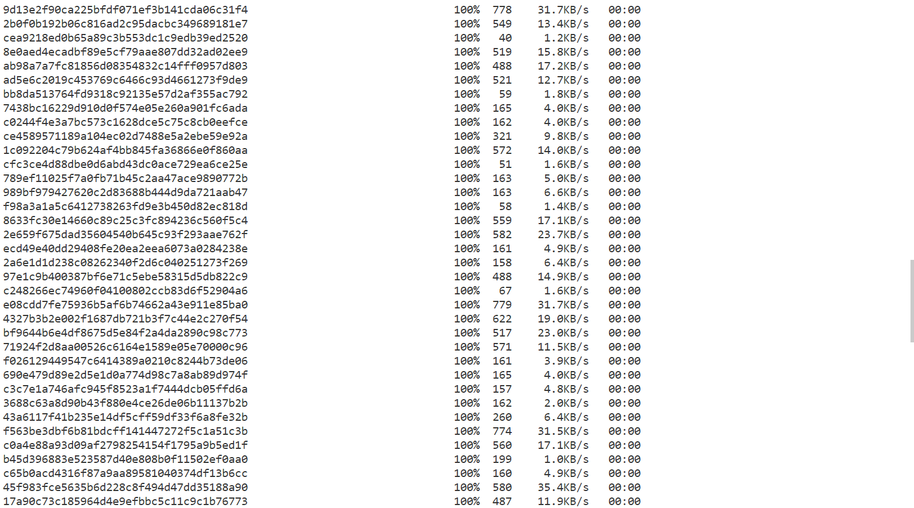

# **Lab Report 3**
>## *All Group Choice Options (1-3) from Lab 5*

### **Streamlining ssh Configuration**

>used the terminal to open the ssh config file in VScode

I opened my `.ssh/config` file by putting `~/.ssh/config` in my local terminal then selected open with VScode.

>`.ssh/config` file after editing it

>logging in with the alias `ieng6`

>used `scp` and `ssh` with alias instead of the whole username

### **Setup Github Access from ieng6**

>this is where my public key is stored on my Github user account

>this is where my private key is stored on my ieng6 user account. I accessed the files in my ieng6 account through VScode.

>committing and pushing to Github using the terminal in my ieng6 account.

[link of commit](https://github.com/KristinEbu/markdown-parser/commit/6338e63200c5c39882d7c741adf47de71efab332)

### **Copy whole directories with `scp -r`**

>copying markdown-parse directory to my ieng6 account

>running Junit tests on ieng6 account

>copying markdown-parse and running tests in one line (the terminal output was so long that I had to take 6 screenshots of it to get the whole thing)