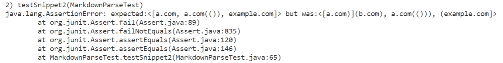

# **Lab Report 4**
>## *Markdown-parse Snippet Testing*

### **Markdown-parse Repositories**
[link to my repository](https://github.com/KristinEbu/markdown-parser)

[link to the reviewed repository](https://github.com/bchoUCSD/markdown-parser)

### **Snippet 1**

>JUnit test setup for my repository (used VScode preview for expected values)

>JUnit test failure for my repository

>JUnit test failure for the reviewed repository

If we're just attempting to make all related cases that use inline code with backticks (`) to work, I think a small code change will be needed. As of now, my code assumes there won't be any unnecessary characters (characters that aren't brackets, parentheses, and the link itself), so instead of getting links in terms of brackets/parentheses, it uses the length of the line as a reference more often. I think this problem could be easily fixed if I change the code to use indices of the brackets/parentheses as a reference of where to substring.

### **Snippet 2**

>JUnit test setup for my repository (used VScode preview for expected values)

>JUnit test failure for my repository

>JUnit test failure for the reviewed repository

I don't think it'll only take a small code change to make sure the program works for all related cases that nest parentheses, brackets, and escaped brackets. As of now, my code uses the `indexof` method to locate brackets/parentheses which returns the first occurance of the symbol. If there are multiple brackets/parentheses then it'll disrupt my entire basic structure of the code which is using `indexof`.

### **Snippet 3**

>JUnit test setup for my repository (used VScode preview for expected values)

>JUnit test failure for my repository

>JUnit test failure for the reviewed repository

I think this has the same problem as snippet 1, so it should only take a small code change. If I change the substring references to be in terms of brackets/parentheses indices, I think it should work. However, I do believe that new lines could potentially cause more problems, so I wouldn't know if this is a small code change or not until I actually try to debug it.