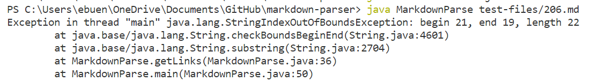

# **Lab Report 5**
>## *Tests corresponding to different bugs*

### **How did you find the tests with different results**
I found these tests by searching through manually. I would select random test files to manually check if the outputs were different.

### **Test 1**
[link to 206.md test file](https://github.com/nidhidhamnani/markdown-parser/blob/main/test-files/206.md)

Both my implementation and the provided implementation are incorrect (they give the wrong output).

>the expected output is that `/φου` is a valid link

>my output when I tried runnning MarkdownParse with 206.md

>the provided implementation's output when I tried runnning MarkdownParse with 206.md

The bug in my code is that for some reason `beginLink` ends up being greater than `endLink`, so when we try creating a substring with `beginLink` as the starting point and `endLink` as the end point, an index out of bounds exception occurs. I think the line for finding a new line in the file might be incorrect and is what's causing `beginLink` and `endLink` to be the wrong indices.

>the highlighted lines are the lines that should be changed 

### **Test 2**
[link to 500.md test file](https://github.com/nidhidhamnani/markdown-parser/blob/main/test-files/500.md)

My implementation is incorrect (gives the wrong output) while the provided implementation is correct (gives the right output).

>the expected output is that all three are valid links

>my output when I tried runnning MarkdownParse with 500.md

>the provided implementation's output when I tried runnning MarkdownParse with 500.md

The bug in my code is that for some reason the parenthesis is added at the end of the link as if it's part of the link itself. This means that `endLink` needs to be changed. This could be easily fixed for this specific case if we change `endLink = newLine - 2`, but I'm not sure if this will fix any case. This code passed for previous testing examples such as "test-file.md," so I'm not entirely sure why there's an extra parentheis for this case. It's also possible that initializing `newLine` to a value could also be the problem as mentioned in my explanation for Test 1; especially since "test-file.md" only has line in the file.
.png)
>the highlighted lines are the lines that should be changed 